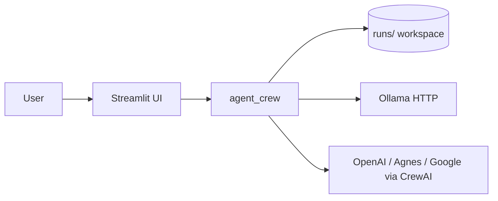
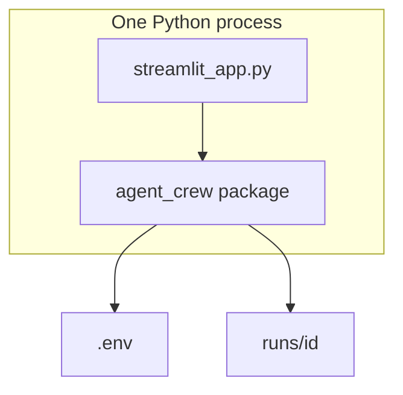
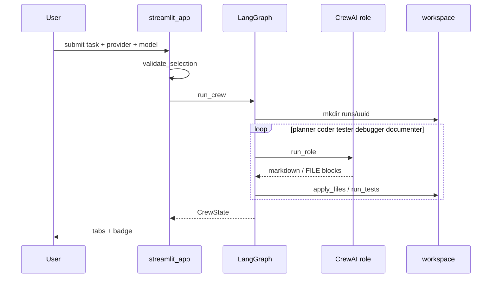
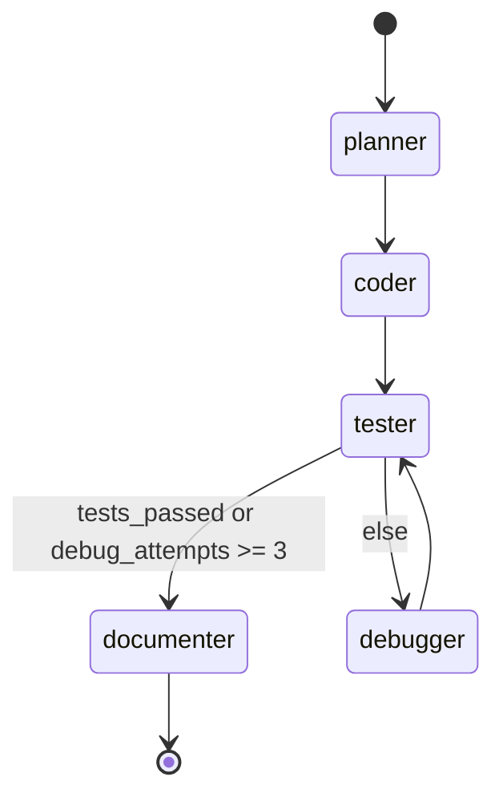

# Architecture — Autonomous Coding Agent Crew

Local-first snapshot of the checkout on disk. Every claim cites a file. Gaps are marked `[INFERRED]` or `[UNVERIFIED]`.

## Part 1 — Whole-repo technical deep-dive

### What this repository is

Phase 1 coding crew. A user submits a coding task. Five CrewAI roles (planner, coder, tester, debugger, documenter) run in a LangGraph sequence. Streamlit is the UI. Each job writes files under `runs/<id>/`. Cited: [README.md](README.md) (opening paragraph and flow line).

### Tech-stack detection

| Layer | Technology | Evidence |
| --- | --- | --- |
| Language | Python 3.12 | [`.python-version`](.python-version)#L1; [`pyproject.toml`](pyproject.toml)#L9 `requires-python = ">=3.12"` |
| Package manager | uv + `uv.lock` | [`pyproject.toml`](pyproject.toml)#L20-L22 `uv_build`; [`uv.lock`](uv.lock) present |
| Agents | CrewAI `>=0.80` | [`pyproject.toml`](pyproject.toml)#L11; [`src/agent_crew/crew.py`](src/agent_crew/crew.py)#L3 |
| Control flow | LangGraph `>=0.4` | [`pyproject.toml`](pyproject.toml)#L12; [`src/agent_crew/graph.py`](src/agent_crew/graph.py)#L7 |
| UI | Streamlit `>=1.57` | [`pyproject.toml`](pyproject.toml)#L14; [`streamlit_app.py`](streamlit_app.py)#L3 |
| Config | python-dotenv | [`pyproject.toml`](pyproject.toml)#L13; [`src/agent_crew/settings.py`](src/agent_crew/settings.py)#L6-L9 |
| Lint / format | Ruff `>=0.16.3` | [`pyproject.toml`](pyproject.toml)#L33-L35, #L45-L66 |
| Types | ty `>=0.0.72` | [`pyproject.toml`](pyproject.toml)#L35, #L109-L121 |
| Tests | pytest + pytest-cov | [`pyproject.toml`](pyproject.toml)#L37-L39, #L76-L85 |
| Audit | pip-audit | [`pyproject.toml`](pyproject.toml)#L25-L27 |
| Hooks | prek + `.pre-commit-config.yaml` | [`.pre-commit-config.yaml`](.pre-commit-config.yaml); [`Makefile`](Makefile)#L20-L24 |
| CI | GitHub Actions | [`.github/workflows/ci.yml`](.github/workflows/ci.yml)#L1-L39 |

### Entry points

| Surface | Path | How it starts |
| --- | --- | --- |
| UI | [`streamlit_app.py`](streamlit_app.py)#L1-L8 | `uv run streamlit run streamlit_app.py` ([README.md](README.md) Run section; [`run.cmd`](run.cmd)#L25) |
| CLI script | [`src/agent_crew/__init__.py`](src/agent_crew/__init__.py)#L8-L11 | `uv run agent-crew` → same Streamlit app ([`pyproject.toml`](pyproject.toml)#L17-L18) |
| Library | [`src/agent_crew/graph.py`](src/agent_crew/graph.py)#L152-L169 | `run_crew(task, provider, model)` |

There is no HTTP API, no database server, and no Docker entrypoint in this checkout.

### Commands & Verification Inventory

| Command | Purpose | Evidence |
| --- | --- | --- |
| `uv sync --all-groups` | Install runtime + lint + test + audit | [`Makefile`](Makefile)#L3-L4; [`run.cmd`](run.cmd)#L18; [`.github/workflows/ci.yml`](.github/workflows/ci.yml)#L21 |
| `uv run streamlit run streamlit_app.py` | Run UI | [README.md](README.md) Run section; [`run.cmd`](run.cmd)#L25 |
| `uv run agent-crew` | Same UI via console script | [`pyproject.toml`](pyproject.toml)#L17-L18 |
| `uv run pytest` | All tests | [`Makefile`](Makefile)#L14-L15; [`pyproject.toml`](pyproject.toml)#L76-L85 |
| `uv run pytest tests/test_phase1.py` | One file | pytest `testpaths` ([`pyproject.toml`](pyproject.toml)#L77) |
| `uv run pytest tests/test_phase1.py::test_safe_file_rejects_escape` | One test | pytest default; not separately documented |
| `uv run ruff check .` | Lint | [`Makefile`](Makefile)#L8; CI #L25 |
| `uv run ruff format .` / `uv run ruff format --check .` | Format / check | [`Makefile`](Makefile)#L7, #L11-L12; CI #L23 |
| `uv run ty check src/` | Types | [`Makefile`](Makefile)#L9; CI #L27 |
| `uv run pip-audit .` | Advisory scan | [`Makefile`](Makefile)#L26-L27; CI #L32 ignores `PYSEC-2026-311` |
| `uv build` | Wheel/sdist | [`Makefile`](Makefile)#L17-L18 |
| `prek run --all-files` | Hooks | [`Makefile`](Makefile)#L20-L21 |
| End-to-end / contract | **None** | No e2e workflow, no recorded I/O fixtures |

CI: [`.github/workflows/ci.yml`](.github/workflows/ci.yml)#L3-L5 runs on `push` and `pull_request`. Jobs: `check` (format, lint, ty, pytest, pip-audit) and `hooks` (prek).

CI **enforcement** (required status check / branch protection): `[UNVERIFIED]`. No remote, no commits, no GitHub settings on disk.

This session already ran (no Streamlit process): `uv sync --all-groups`, `uv run ruff check .`, `uv run ty check src/`, `uv run pytest` (4 passed, ~45% coverage), `uv run pip-audit .` (chromadb `PYSEC-2026-311`).

### Directory layout

| Path | Purpose |
| --- | --- |
| `src/agent_crew/` | Installable package: 6 modules (`__init__.py`, `crew.py`, `graph.py`, `llm.py`, `settings.py`, `workspace.py`) |
| `tests/` | 1 test module, 4 tests |
| `runs/` | Generated job workspaces; gitignored ([`.gitignore`](.gitignore)#L14) |
| `.github/workflows/` | 1 workflow (`ci.yml`) |
| `.github/` | Also `dependabot.yml`, `copilot-instructions.md` |
| `graphify-out/` | Generated graphify cache; not runtime |
| `.clinerules/`, `.cursor/`, `.opencode/`, `.windsurf/` | Editor/agent overlays; not runtime |

### Deployment & Runtime Surface

| Pin | Value | Evidence |
| --- | --- | --- |
| Local Python | `3.12` | [`.python-version`](.python-version)#L1 |
| Package require | `>=3.12` | [`pyproject.toml`](pyproject.toml)#L9 |
| CI runner | `ubuntu-latest` | [`.github/workflows/ci.yml`](.github/workflows/ci.yml)#L13, #L35 |
| CI Python | `.python-version` via setup-uv | [`.github/workflows/ci.yml`](.github/workflows/ci.yml)#L16-L18 |
| setup-uv | SHA `20cfd1bf…` tag v10.0.1 | [`.github/workflows/ci.yml`](.github/workflows/ci.yml)#L15 |
| checkout | SHA `3d3c42e5…` tag v7.0.1 | [`.github/workflows/ci.yml`](.github/workflows/ci.yml)#L14 |
| prek-action | SHA `4e14d07f…` tag v3.0.0 | [`.github/workflows/ci.yml`](.github/workflows/ci.yml)#L37 |
| Container / compose / serverless | **None** | No Dockerfile, no compose, no `runtime.txt` |
| Data-store images | **None** | No DB/cache/broker |

Build-runtime and run-runtime are the same: host Python 3.12 (local) or whatever `ubuntu-latest` + setup-uv resolve (CI). No image drift. CI `ubuntu-latest` floating tag is a pin-quality gap `[INFERRED]`.

### EOL / dead-dependency scan

| Item | Status | Note |
| --- | --- | --- |
| Python 3.12 | Supported | Not EOL |
| uv / ruff / ty / pytest 9 | Current | Already on the modern-python stack |
| CrewAI / LangGraph / Streamlit | Actively used | Not abandoned on disk |
| chromadb 1.1.1 (transitive via crewai) | Advisory `PYSEC-2026-311` | Chroma HTTP-server RCE; this app never starts Chroma. CI ignores that ID ([`.github/workflows/ci.yml`](.github/workflows/ci.yml)#L30-L32) `[INFERRED]` unused path |

No Python 2, no `requirements.txt`, no Poetry, no mypy/black split.

### Data, APIs, jobs, CI, tests

- **Storage:** filesystem only. Job trees under `RUNS_DIR` ([`settings.py`](src/agent_crew/settings.py)#L18). `.env` loaded from repo root ([`settings.py`](src/agent_crew/settings.py)#L8-L9). No SQL, no vector store in first-party code.
- **Outbound APIs:** Ollama `GET {host}/api/tags` ([`llm.py`](src/agent_crew/llm.py)#L20-L34). Cloud providers via CrewAI `LLM` ([`llm.py`](src/agent_crew/llm.py)#L57-L81).
- **Inbound APIs:** none.
- **Background jobs:** none. `run_crew` is a blocking `graph.invoke` ([`graph.py`](src/agent_crew/graph.py)#L169).
- **CI/CD:** one workflow + Dependabot ([`.github/dependabot.yml`](.github/dependabot.yml)).
- **Tests:** [`tests/test_phase1.py`](tests/test_phase1.py) — routing (2), `apply_files`+pytest (1), path jail (1). No tests for `crew.py`, `llm.py`, `run_crew`, or Streamlit.

---

## Part 2 — Context & ecosystem

### Local checkout identity

| Field | Value |
| --- | --- |
| Remote | none (no `git remote`) |
| Branch | `master` (unborn — no commits) |
| HEAD | none |
| Version | `0.1.0` ([`pyproject.toml`](pyproject.toml)#L3) |
| License | none on disk |
| Authors | Ahmad Mujtaba ([`pyproject.toml`](pyproject.toml)#L6-L8) |

### Agent / contributor docs

| File | Rules |
| --- | --- |
| [`AGENTS.md`](AGENTS.md) | Caveman tone for agent chat. Never launch Streamlit / frontend. Code/commits/PRs stay normal English. |
| [`.github/copilot-instructions.md`](.github/copilot-instructions.md) | Same caveman rules (no Streamlit ban in that copy). |
| [README.md](README.md) | User-facing run/dev docs. |

### Developer gotchas

- `UV_LINK_MODE=copy` in [`run.cmd`](run.cmd)#L4 — Windows hardlink warning otherwise `[INFERRED]` from this session’s uv output.
- `runs/` and `.env` are gitignored ([`.gitignore`](.gitignore)#L13-L14).
- Streamlit must not be launched by repo agents ([`AGENTS.md`](AGENTS.md)#L18). Verify UI by reading `streamlit_app.py` or unit tests only.
- prek on an unborn repo skips `--all-files` (no tracked files). Use `prek run --files …`.
- ty ignores CrewAI/LangGraph stub gaps ([`pyproject.toml`](pyproject.toml)#L115-L121).
- Coverage ~45%; no `--cov-fail-under` ([`pyproject.toml`](pyproject.toml)#L79-L85).

### Ecosystem (on disk only)

Standalone app. Depends on CrewAI, LangGraph, Streamlit, optional Ollama daemon. No sibling repos, no workspace members, no published extra indexes.

---

## Part 3 — Architectural blueprint

### Tech-stack summary

Single Python package + one Streamlit script. Orchestration is LangGraph. Each graph node constructs a one-task CrewAI `Crew` and `kickoff()` ([`crew.py`](src/agent_crew/crew.py)#L53-L58). Providers are an allowlist, not a plugin registry ([`settings.py`](src/agent_crew/settings.py)#L11-L15; [`llm.py`](src/agent_crew/llm.py)#L37-L47).

### C4 diagrams

**Level 1 — System context**



**Level 2 — Containers (deployables)**



There is one process. Streamlit and the graph share it. `run_crew` blocks the request thread ([`graph.py`](src/agent_crew/graph.py)#L169; [`streamlit_app.py`](streamlit_app.py) submit path).

**Level 3 — One task lifecycle**



### Layering

```text
streamlit_app.py  →  graph  →  crew + llm + workspace
                         ↘ settings
```

- UI may import `graph`, `llm`, `settings`. It does ([`streamlit_app.py`](streamlit_app.py)#L5-L7).
- `graph` may import `crew`, `llm`, `settings`, `workspace` ([`graph.py`](src/agent_crew/graph.py)#L9-L12).
- `workspace` is stdlib-only ([`workspace.py`](src/agent_crew/workspace.py)#L1-L6). No UI, no CrewAI.
- Nothing enforces this besides review. No import-linter. `[INFERRED]`

### Cross-cutting concerns

| Concern | Location | Evidence |
| --- | --- | --- |
| Auth | None (app-level) | Provider API keys via env ([`llm.py`](src/agent_crew/llm.py)#L64, #L75, #L80) |
| Config | `.env` + constants | [`settings.py`](src/agent_crew/settings.py)#L8-L18 |
| Logging | `CrewState["log"]` strings | [`graph.py`](src/agent_crew/graph.py)#L27, #L38-L39 |
| Metrics / tracing | None | — |
| Secrets | `.env` gitignored; `.streamlit/secrets.toml` gitignored | [`.gitignore`](.gitignore)#L13, #L21. Not `st.secrets`. |
| Errors | `RuntimeError` / `ValueError`; UI `st.session_state.error` | [`llm.py`](src/agent_crew/llm.py)#L52-L54; [`workspace.py`](src/agent_crew/workspace.py)#L18; [`streamlit_app.py`](streamlit_app.py)#L10-L11 |
| Feature flags | None | — |
| Path safety | resolve + `is_relative_to` | [`workspace.py`](src/agent_crew/workspace.py)#L14-L19 |

### Inferred ADRs

#### ADR: LangGraph owns control flow; CrewAI owns one role at a time
- **Context:** Need a debug loop with a cap.
- **Decision:** `StateGraph` + `route_after_tester` ([`graph.py`](src/agent_crew/graph.py)#L30-L35, #L132-L149). Each node calls `run_role` for one agent.
- **Why not one multi-task Crew:** `[INFERRED]` a Crew cannot express “retry debugger until N then documenter” as clearly as a graph.

#### ADR: Fresh `runs/<8 hex>` workspace per job
- **Decision:** [`graph.py`](src/agent_crew/graph.py)#L153-L154.
- **Consequence:** Isolated toys. Not a patch on the user’s repo.

#### ADR: `### FILE:` markdown is the write protocol
- **Decision:** [`crew.py`](src/agent_crew/crew.py)#L61-L68; parser [`workspace.py`](src/agent_crew/workspace.py)#L8-L11.
- **Consequence:** Whole-file overwrite. No hunks. Tester and debugger can rewrite tests.

#### ADR: Allowlisted models; Ollama listed live
- **Decision:** [`settings.py`](src/agent_crew/settings.py)#L11-L15; [`llm.py`](src/agent_crew/llm.py)#L20-L54.
- **Consequence:** Cloud model names are code, not discovery.

#### ADR: Max 3 debug attempts, then document anyway
- **Decision:** `MAX_DEBUG_ATTEMPTS = 3` ([`settings.py`](src/agent_crew/settings.py)#L16); exhausted → documenter ([`graph.py`](src/agent_crew/graph.py)#L33-L34).
- **Consequence:** A red run still gets a README. Fail-open.

### Governance

- CI workflow exists; enforcement `[UNVERIFIED]`.
- No `CODEOWNERS`.
- Ruff `ALL` with listed ignores ([`pyproject.toml`](pyproject.toml)#L50-L62).
- Dependabot weekly, 7-day cooldown ([`.github/dependabot.yml`](.github/dependabot.yml)).
- Trunk name today: `master` (unborn).

### How to add a feature

1. Put domain logic in `src/agent_crew/`, not in `streamlit_app.py`.
2. If the loop changes, edit [`graph.py`](src/agent_crew/graph.py) nodes/edges and `CrewState`.
3. If writes change, edit [`workspace.py`](src/agent_crew/workspace.py) and add a test next to [`tests/test_phase1.py`](tests/test_phase1.py).
4. If a provider is added, extend `PROVIDERS` + `models_for` + `make_llm` together.
5. Run `uv run ruff check .` and `uv run pytest`.

**Pitfalls**

- Do not launch Streamlit from an agent ([`AGENTS.md`](AGENTS.md)#L18).
- `apply_files` writes any `### FILE:` path, including `test_*.py`. Debugger can “fix” tests.
- `snapshot()` dumps the whole tree into the next prompt ([`workspace.py`](src/agent_crew/workspace.py)#L32-L38).
- `run_crew` is synchronous and can take minutes. The Streamlit run stays blocked.

---

## Subsystem deep-dives

### 1. LangGraph control loop

**Structure.** `CrewState` is a `TypedDict` with task, provider, model, workspace path, artifacts, `tests_passed`, `debug_attempts`, `log` ([`graph.py`](src/agent_crew/graph.py)#L15-L27).

**State machine**



`route_after_tester` ([`graph.py`](src/agent_crew/graph.py)#L30-L35) is the only conditional. `MAX_DEBUG_ATTEMPTS` is 3 ([`settings.py`](src/agent_crew/settings.py)#L16). Tests pin pass → documenter, fail → debugger, exhausted → documenter ([`tests/test_phase1.py`](tests/test_phase1.py)#L10-L22).

**Nodes (all rebuild agents each call via `_agents` → `make_llm` + `build_agents`):**

| Node | Writes | Evidence |
| --- | --- | --- |
| planner | `plan` | [`graph.py`](src/agent_crew/graph.py)#L46-L55 |
| coder | `code` + `apply_files` | #L58-L71 |
| tester | `tests`, `apply_files`, `run_tests` | #L74-L92 |
| debugger | `code`, `debug_attempts+1`, `apply_files` | #L95-L114 |
| documenter | `docs`, `apply_files` | #L117-L129 |

**Data flow.** User string in; `CrewState` out. Disk is a side effect. Tester sees `snapshot(workspace)` after coder ([`graph.py`](src/agent_crew/graph.py)#L79). That is how tests can match the impl instead of the request.

### 2. Workspace write + test protocol

**Parser.** `FILE_BLOCK` regex ([`workspace.py`](src/agent_crew/workspace.py)#L8-L11): `### FILE: path` then a fenced block.

**Jail.** `safe_file` resolves and requires `is_relative_to(workspace)` ([`workspace.py`](src/agent_crew/workspace.py)#L14-L19). Covered by [`tests/test_phase1.py`](tests/test_phase1.py)#L47-L49.

**Tests.** Any `test_*.py` or `*_test.py` under the workspace; else fail with a string ([`workspace.py`](src/agent_crew/workspace.py)#L41-L48). Subprocess: `sys.executable -m pytest -q --tb=short`, timeout 90s, last 8000 chars of output (#L49-L58).

**Gap.** No `protect_tests`. Coder, tester, debugger, documenter all call the same `apply_files`.

### 3. Provider factory

**Allowlist.** `PROVIDERS` tuple ([`settings.py`](src/agent_crew/settings.py)#L11). `models_for` / `validate_selection` / `make_llm` ([`llm.py`](src/agent_crew/llm.py)#L37-L81).

**Ollama.** HTTP tags, 3s timeout, fail → empty list ([`llm.py`](src/agent_crew/llm.py)#L20-L34). Empty list + ollama → “Is Ollama running?” (#L51-L52).

**OpenAI.** `reasoning_effort="medium"`; optional `OPENAI_BASE_URL` sets `custom_openai` (#L61-L71).

**UI cache.** `@st.cache_data(ttl="30s", max_entries=8)` ([`streamlit_app.py`](streamlit_app.py)#L17-L19).

---

## Confidence assessment

| Area | Rating | Why |
| --- | --- | --- |
| Package layout, deps, commands | High | Read `pyproject.toml`, Makefile, CI |
| Graph topology and routing | High | Read `graph.py` + tests |
| Workspace jail and FILE protocol | High | Read `workspace.py` + tests |
| Provider mapping | High | Read `llm.py` + `settings.py` |
| Streamlit behavior at runtime | Inferred | Code read; app not launched (repo policy) |
| CI required-check enforcement | Unverified | No remote / GitHub settings |
| chromadb unused in this app | Inferred | No first-party import; transitive via crewai |
| Why CrewAI+LangGraph split | Inferred | Reconstructed, not documented as an ADR on disk |

---

## Footnotes — local file citations

| File | Establishes |
| --- | --- |
| `README.md` | User-facing identity and run path |
| `pyproject.toml` | Versions, groups, ruff/ty/pytest, script |
| `.python-version` | Runtime pin 3.12 |
| `src/agent_crew/graph.py` | Control loop and `run_crew` |
| `src/agent_crew/workspace.py` | FILE protocol, jail, pytest |
| `src/agent_crew/crew.py` | Roles and FILE_FORMAT |
| `src/agent_crew/llm.py` | Providers |
| `src/agent_crew/settings.py` | Constants and `.env` |
| `src/agent_crew/__init__.py` | CLI → Streamlit |
| `streamlit_app.py` | UI |
| `tests/test_phase1.py` | What is actually tested |
| `.github/workflows/ci.yml` | Automated gates |
| `Makefile` / `run.cmd` | Local commands |
| `AGENTS.md` | No Streamlit launch |
| `.gitignore` | Secrets and `runs/` |
