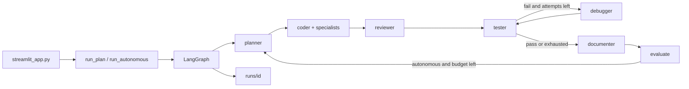

<div align="center">

# Autonomous Coding Agent Crew

CrewAI specialists + LangGraph. Parallel build, reviewer, votes, quality gates.

https://github.com/pypi-ahmad/autonomous-coding-agent-crew

[](https://github.com/pypi-ahmad/autonomous-coding-agent-crew/actions)
[](LICENSE)
[](https://www.python.org)
[](https://docs.astral.sh/uv/)
[](https://www.crewai.com)
[](https://langchain-ai.github.io/langgraph/)
[](https://streamlit.io)

[Features](#features) • [Getting started](#getting-started) • [Usage](#usage) • [Providers](#providers) • [Development](#development) • [Docs](#docs)

</div>

`agent-crew` `0.1.0` is a local-first, hybrid CrewAI + LangGraph coding crew with a Streamlit dashboard. Describe a coding task or a high-level goal; a planner, parallel coder specialists (backend/frontend/database as needed), a reviewer, a tester, a debugger, and a documenter take turns through a LangGraph pipeline, with CrewAI agents doing the reasoning at each step. Point it at a blank folder with a template, or an existing project — it detects the stack either way. You approve the plan, review the diff after coding, then quality gates (tests, coverage, lint, types, security, perf) decide whether the run goes to the debugger or to docs. Everything lands in `runs/<id>/`.

```text
detect → plan + vote → parallel specialists + tester → reviewer → gates ↔ debug → docs
```

> [!TIP]
> Local and free: start [Ollama](https://ollama.com/), pull a model, leave `.env` keys empty, toggle "Fully local" in the sidebar.

## Features

- **Dashboard** — live activity feed, file tree, diff, terminal output, test metrics, token usage, execution timeline
- **Parallel build** — backend / frontend / database / tester run together when the stack isn't simple
- **Reviewer** — architecture pass, separate from the debugger; one revise loop
- **Votes + conflicts** — plan APPROVE/REVISE majority; overlapping file writes logged and merged by role priority
- **Quality gates** — tests, coverage floor (70%), ruff, ty, security scan, perf probe — a fail routes to the debugger/tester, not to docs
- **Autonomous mode** — skip the approval pauses; loop planner → code → test → eval until the goal is met or a cycle budget runs out
- **Stack detect** — Python, JS, Go, Java markers; FastAPI, Flask, Django, React, Next.js, Express, Streamlit
- **12 templates + 5 database overlays** — scaffold a blank project, or lay a database (SQLite, SQLAlchemy-shaped, Postgres, Prisma) on top
- **Memory + eval** — recall past lessons across runs; score /100 with `EVAL.md`
- **Reliability** — retries with backoff, fallback plan, resume from `run.json`, git-based rollback on exhausted debug attempts
- **Permissions** — write / terminal / pip toggles, dry-run, locked file globs
- **Configuration** — max debug attempts and coverage floor tunable per run; one-click Clean project / Reset environment
- **Rotating log** — `runs/agent-crew.log`, app-wide, survives a "Reset environment"
- **Export** — project zip, `REPORT.md`, `HEALTH.md`, `QUALITY.md`, `HISTORY.md`; missing deps auto-installed into `requirements.txt`

## How it works



Full module-by-module breakdown: [REFERENCE.md → Module index](REFERENCE.md#module-index).

## Getting started

Needs [uv](https://docs.astral.sh/uv/) and Python 3.12.

1. `git clone https://github.com/pypi-ahmad/autonomous-coding-agent-crew.git`
2. `cd autonomous-coding-agent-crew`
3. `uv sync --all-groups`
4. `copy .env.example .env` (Windows) or `cp .env.example .env`
5. Fill keys for the provider you'll use (skip this for Ollama)
6. Double-click `run.cmd` (Windows) or run `./run.sh` (Linux/macOS), or use the command in [Usage](#usage)

> [!IMPORTANT]
> Never commit `.env`.

## Usage

```bash
uv run streamlit run streamlit_app.py
```

Same app via the package script:

```bash
uv run agent-crew
```

`run.cmd` (Windows) / `run.sh` (Linux/macOS) run `uv sync`, copy `.env.example` if `.env` is missing, then start Streamlit — a first-time user can just double-click `run.cmd` or run `./run.sh`.

For a full first-run walkthrough and task recipes (templates, databases, dry-run, locked files, autonomous mode, resuming a checkpoint, exporting), see **[HOW_TO.md](HOW_TO.md)**.

## Providers

| Provider | Models | Env |
| --- | --- | --- |
| Ollama | listed live from the local daemon | optional `OLLAMA_HOST` (default `http://127.0.0.1:11434`) |
| OpenAI | `gpt-5.6-luna`, `gpt-5.6-terra` (medium effort) | `OPENAI_API_KEY`, optional `OPENAI_BASE_URL` |
| Agnes AI | `agnes-2.5-flash` | `AGNES_API_KEY` |
| Google | `gemini-3.5-flash-lite`, `gemini-3.7-flash` | `GOOGLE_API_KEY` |

## Project layout

```text
src/agent_crew/     package
streamlit_app.py    UI
tests/              pytest
runs/               job trees (gitignored)
Makefile            lint, test, audit, hooks
.github/workflows/  CI
```

## Development

```bash
uv run ruff format .
uv run ruff check .
uv run ty check src/
uv run pytest
uv run pip-audit .
```

Makefile targets: `make dev`, `make lint`, `make test`, `make audit`, `make hooks`.

CI (`.github/workflows/ci.yml`) runs format, lint, types, tests, pip-audit, and prek. Dependabot updates pip and GitHub Actions weekly with a 7-day cooldown.

> [!NOTE]
> Tests cover routing, `apply_files` + nested pytest, and path escape. Coverage is reported; there's no fail-under gate on this repo's own suite (the generated-project quality gate is separate — see Quality gates above).

## Docs

[ARCHITECTURE.md](ARCHITECTURE.md) (system design) · [REFERENCE.md](REFERENCE.md) (module/API dictionary) · [HOW_TO.md](HOW_TO.md) (tutorial + recipes) · [MODERNIZATION_PLAN.md](MODERNIZATION_PLAN.md) (forward plan)

Bugs and feature ideas: [CONTRIBUTING.md](CONTRIBUTING.md) and the [issue templates](.github/ISSUE_TEMPLATE/). Security reports: [SECURITY.md](SECURITY.md). Community: [SUPPORT.md](SUPPORT.md). Data/cost responsibility: [DISCLAIMER.md](DISCLAIMER.md). License: [MIT](LICENSE).

Runs entirely on your machine with your own API keys, or fully free via Ollama — no data goes to the maintainer, no donations wanted.

<div align="center">

Made with ❤️ by Ahmad Mujtaba

</div>
