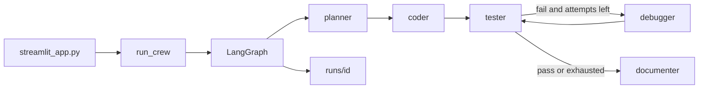

<div align="center">

# Autonomous Coding Agent Crew

CrewAI specialists + LangGraph. Parallel build, reviewer, votes, quality gates.

https://github.com/pypi-ahmad/autonomous-coding-agent-crew

[](https://github.com/pypi-ahmad/autonomous-coding-agent-crew/actions)
[](https://www.python.org)
[](https://docs.astral.sh/uv/)
[](https://www.crewai.com)
[](https://langchain-ai.github.io/langgraph/)
[](https://streamlit.io)

Cited architecture: [ARCHITECTURE.md](ARCHITECTURE.md). Forward plan: [MODERNIZATION_PLAN.md](MODERNIZATION_PLAN.md).

</div>

## Index

- [Features](#features)
- [How it works](#how-it-works)
- [Getting started](#getting-started)
- [Run](#run)
- [Providers](#providers)
- [Project layout](#project-layout)
- [Development](#development)
- [Contributing](#contributing) · [Disclaimer](#disclaimer) · [License](#license)
- Other docs: [ARCHITECTURE.md](ARCHITECTURE.md) · [MODERNIZATION_PLAN.md](MODERNIZATION_PLAN.md) · [CONTRIBUTING.md](CONTRIBUTING.md) · [SECURITY.md](SECURITY.md) · [SUPPORT.md](SUPPORT.md) · [DISCLAIMER.md](DISCLAIMER.md) · [LICENSE](LICENSE)

`agent-crew` `0.1.0` is a local-first, hybrid CrewAI + LangGraph coding crew with a Streamlit dashboard. Describe a coding task or a high-level goal; a planner, parallel coder specialists (backend/frontend/database as needed), a reviewer, a tester, a debugger, and a documenter take turns through a LangGraph pipeline, with CrewAI agents doing the actual reasoning at each step. One prompt can scaffold a fresh Python or JS project from a template, or point it at an existing folder and it detects the stack. You approve the plan, review the diff after coding, then quality gates (tests, coverage, lint, types, security, perf) decide whether the run goes to the debugger or straight to docs. Everything lands in `runs/<id>/`: the generated project, a `REPORT.md`/`HISTORY.md`/`HEALTH.md`, and a zip export. Runs entirely on your machine — bring your own API key, or use Ollama for free and fully local.

```text
detect → plan + vote → parallel specialists + tester → reviewer → gates ↔ debug → docs
```

> [!TIP]
> Local and free: start [Ollama](https://ollama.com/), pull a model, leave `.env` keys empty.

## Features

- **Dashboard** — live activity feed, file tree, diff, test metrics, execution timeline
- **Parallel build** — backend / frontend / database / tester run together when the stack is not simple
- **Reviewer** — architecture pass, separate from debugger; one revise loop
- **Votes + conflicts** — plan APPROVE/REVISE majority; overlapping FILE writes logged and merged by role priority
- **Quality gates** — tests, coverage floor (70%), ruff, ty, security scan, perf probe. Fail → debugger/tester, not docs
- **Test levels** — unit, integration, edge, optional perf. Tester rewrites twice if coverage or levels missing
- **Stack detect** — Python, JS, Go, Java markers; FastAPI, Flask, Django, React, Next.js, Express, Streamlit
- **Templates** — library, CLI, FastAPI, Flask, Django, Streamlit, data science, Express, React, Next.js, full-stack
- **Databases** — SQLite, SQLAlchemy-shaped, Postgres URL, Prisma schema
- **Export** — project zip, `REPORT.md`, `HEALTH.md`, `QUALITY.md`, conversation `HISTORY.md`; missing deps auto-installed into `requirements.txt`
- **Permissions** — write / terminal / pip toggles, dry-run, locked file globs
- **Codebase map** — cached, parallel file summary; feature-add on a copied folder
- **Tools** — search, token-overlap search, rename, allowlisted `pip`/`pytest`/`git`
- **Planner** — sub-tasks, order, risks, edge cases
- **Memory + eval** — recall past lessons; score /100 + EVAL.md
- **Reliability** — retries with backoff, fallback plan, resume from `run.json`

## How it works



| Module | Job |
| --- | --- |
| `src/agent_crew/crew.py` | CrewAI roles and `### FILE:` format |
| `src/agent_crew/graph.py` | LangGraph nodes and routing |
| `src/agent_crew/llm.py` | Provider factory |
| `src/agent_crew/workspace.py` | Apply files, run pytest, path jail, report/history |
| `src/agent_crew/policy.py` | Dry-run, permission flags, locked globs |
| `src/agent_crew/shell.py` | Allowlisted sandboxed exec: python/pip/pytest/node/git |
| `src/agent_crew/tools.py` | CrewAI `BaseTool` wrappers over fs/quality/search/terminal |
| `src/agent_crew/templates.py` | Project stubs and database overlays |
| `src/agent_crew/stack.py` | Detect language, framework, database; inject practices |
| `src/agent_crew/quality.py` | Gates, test levels, lint, types, security, perf |
| `src/agent_crew/collab.py` | Roster, votes, parallel run, conflict merge |
| `src/agent_crew/autonomy.py` | Sub-task tracking, missing-dep auto-install, `HEALTH.md` report |
| `src/agent_crew/codeintel.py` | Cached project summary, code/semantic search, symbol rename, traceback blame |
| `src/agent_crew/memory.py` | JSONL memory store: recall past outcomes, record win/fail lessons |
| `src/agent_crew/reliability.py` | Role-call retry/backoff, fallback plan, heuristic scoring |
| `src/agent_crew/settings.py` | Providers, models, `MAX_DEBUG_ATTEMPTS` |
| `streamlit_app.py` | Dashboard UI |

## Getting started

Needs [uv](https://docs.astral.sh/uv/) and Python 3.12.

1. `git clone https://github.com/pypi-ahmad/autonomous-coding-agent-crew.git`
2. `cd autonomous-coding-agent-crew`
3. `uv sync --all-groups`
4. `copy .env.example .env` (Windows) or `cp .env.example .env`
5. Fill keys for the provider you will use (skip this for Ollama)
6. Double-click `run.cmd`, or run the command in [Run](#run)

> [!IMPORTANT]
> Never commit `.env`.

## Run

```bash
uv run streamlit run streamlit_app.py
```

Same app via the package script:

```bash
uv run agent-crew
```

`run.cmd` does `uv sync`, copies `.env.example` if `.env` is missing, then starts Streamlit.

## Providers

| Provider | Models | Env |
| --- | --- | --- |
| Ollama | listed live from the local daemon | optional `OLLAMA_HOST` (default `http://127.0.0.1:11434`) |
| OpenAI | `gpt-5.6-luna`, `gpt-5.6-terra` (medium effort) | `OPENAI_API_KEY`, optional `OPENAI_BASE_URL` |
| Agnes AI | `agnes-2.5-flash` | `AGNES_API_KEY` |
| Google | `gemini-3.5-flash-lite`, `gemini-3.7-flash` | `GOOGLE_API_KEY` |

## Project layout

```text
src/agent_crew/     package
streamlit_app.py    UI
tests/              pytest
runs/               job trees (gitignored)
Makefile            lint, test, audit, hooks
.github/workflows/  CI
```

## Development

```bash
uv run ruff format .
uv run ruff check .
uv run ty check src/
uv run pytest
uv run pip-audit .
```

Makefile targets: `make dev`, `make lint`, `make test`, `make audit`, `make hooks`.

CI (`.github/workflows/ci.yml`) runs format, lint, types, tests, pip-audit, and prek. Dependabot updates pip and GitHub Actions weekly with a 7-day cooldown.

> [!NOTE]
> Tests cover routing, `apply_files` + nested pytest, and path escape. Coverage is reported; there is no fail-under gate on this repo's own suite (the generated-project quality gate is separate, see Quality gates above).

## Contributing

Bugs, feature ideas, and PRs welcome — see [CONTRIBUTING.md](CONTRIBUTING.md). Report bugs or request features via the [issue templates](.github/ISSUE_TEMPLATE/). Security issues: see [SECURITY.md](SECURITY.md), not a public issue.

No donations, sponsorship, or financial support is needed or accepted — see [SUPPORT.md](SUPPORT.md).

## Disclaimer

Runs entirely on your machine with your own API keys (or fully free via Ollama). You are solely responsible for any code, files, or data you load into it and for any provider costs incurred; no data is sent to the maintainer. No warranty — see [DISCLAIMER.md](DISCLAIMER.md).

## License

[MIT](LICENSE)

<div align="center">

Made with ❤️ by Ahmad Mujtaba

</div>
