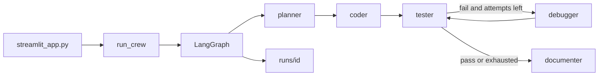

<div align="center">

# Autonomous Coding Agent Crew

Five CrewAI roles. One LangGraph loop. A Streamlit form.

[](https://www.python.org)
[](https://docs.astral.sh/uv/)
[](https://www.crewai.com)
[](https://langchain-ai.github.io/langgraph/)
[](https://streamlit.io)

[Features](#features) • [Getting started](#getting-started) • [Run](#run) • [Providers](#providers) • [Development](#development)

Cited architecture: [ARCHITECTURE.md](ARCHITECTURE.md). Forward plan: [MODERNIZATION_PLAN.md](MODERNIZATION_PLAN.md).

</div>

Phase 1 package `agent-crew` (`0.1.0`). You type a coding task. A planner, coder, tester, debugger, and documenter take turns. Each job lands in `runs/<id>/`.

```text
task → plan → code → tests → debug (max 3) → docs
```

> [!TIP]
> Local and free: start [Ollama](https://ollama.com/), pull a model, leave `.env` keys empty.

## Features

- **Five-role crew** — planner, coder, tester, debugger, documenter
- **Bounded debug loop** — tester fail routes to debugger at most three times, then documenter
- **Path jail** — `safe_file` refuses writes outside the job workspace
- **Pinned model lists** — Ollama is live from the daemon; cloud models are allowlisted
- **Batched UI** — Streamlit form submits once; results show plan, code, tests, docs, and pytest output

## How it works



| Module | Job |
| --- | --- |
| `src/agent_crew/crew.py` | CrewAI roles and `### FILE:` format |
| `src/agent_crew/graph.py` | LangGraph nodes and routing |
| `src/agent_crew/llm.py` | Provider factory |
| `src/agent_crew/workspace.py` | Apply files, run pytest, path jail |
| `src/agent_crew/settings.py` | Providers, models, `MAX_DEBUG_ATTEMPTS` |
| `streamlit_app.py` | UI |

## Getting started

Needs [uv](https://docs.astral.sh/uv/) and Python 3.12.

1. `uv sync --all-groups`
2. `copy .env.example .env` (Windows) or `cp .env.example .env`
3. Fill keys for the provider you will use (skip this for Ollama)
4. Double-click `run.cmd`, or run the command in [Run](#run)

> [!IMPORTANT]
> Never commit `.env`.

## Run

```bash
uv run streamlit run streamlit_app.py
```

Same app via the package script:

```bash
uv run agent-crew
```

`run.cmd` does `uv sync`, copies `.env.example` if `.env` is missing, then starts Streamlit.

## Providers

| Provider | Models | Env |
| --- | --- | --- |
| Ollama | listed live from the local daemon | optional `OLLAMA_HOST` (default `http://127.0.0.1:11434`) |
| OpenAI | `gpt-5.6-luna`, `gpt-5.6-terra` (medium effort) | `OPENAI_API_KEY`, optional `OPENAI_BASE_URL` |
| Agnes AI | `agnes-2.5-flash` | `AGNES_API_KEY` |
| Google | `gemini-3.5-flash-lite`, `gemini-3.7-flash` | `GOOGLE_API_KEY` |

## Project layout

```text
src/agent_crew/     package
streamlit_app.py    UI
tests/              pytest
runs/               job trees (gitignored)
Makefile            lint, test, audit, hooks
.github/workflows/  CI
```

## Development

```bash
uv run ruff format .
uv run ruff check .
uv run ty check src/
uv run pytest
uv run pip-audit .
```

Makefile targets: `make dev`, `make lint`, `make test`, `make audit`, `make hooks`.

CI (`.github/workflows/ci.yml`) runs format, lint, types, tests, pip-audit, and prek. Dependabot updates pip and GitHub Actions weekly with a 7-day cooldown.

> [!NOTE]
> Tests cover routing, `apply_files` + nested pytest, and path escape. Coverage is reported; there is no fail-under gate.
